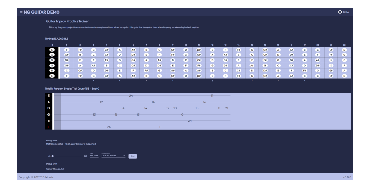

<div id="top"></div>
<div align="center">
  <a href="https://github.com/TimDMorris/ng-guitar">
    
  </a>
</div>

<h1 align="center">NG-GUITAR</h1>
<h2 align="center">For Those About To Code We Salute You</h2>

<br/>

Guitar Related Components built for Angular Material.

<br/>

<div>
<p>

  <a href="http://localhost:4200" target="_blank">
    
  </a>
  <a href="https://twitter.com/TimDMorris" target="_blank">
    
  </a>
</p>
</div>

<br/>

<p>
<a href="https://timdmorris.github.io/ng-guitar/"></a>
<a href="https://timdmorris.github.io/ng-guitar/shared-storybook/index.html"></a>
<a href="https://timdmorris.github.io/ng-guitar/docs/index.html"></a>
</p>
<br/>
<div>
  <a href="https://github.com/tophat/getting-started/blob/master/scorecard.md" target="_blank">
    
  </a> &nbsp;This is a new project that is actively under development.  There will be refactoring!
</div>

<br>

<p>


[](https://github.com/TimDMorris/ng-guitar/actions)
[](https://github.com/TimDMorris/ng-guitar/actions/workflows/codeql-analysis.yml)

</p>

<br/>

<!-- TABLE OF CONTENTS -->
<details>
  <summary>Table of Contents</summary>
  <ol>
    <li>
      <a href="#about-the-project">About The Project</a>
      <ul>
        <li><a href="#built-with">Built With</a></li>
      </ul>
    </li>
    <li>
      <a href="#getting-started">Getting Started</a>
      <ul>
        <li><a href="#prerequisites">Prerequisites</a></li>
        <li><a href="#for-component-consumers">For Component Consumers</a></li>
        <li><a href="#for-contributors">For Contributors</a></li>
        <ul>
          <li><a href="#contributing">Contributing</a></li>
          <li><a href="#install">Install</a></li>
          <li><a href="#usage">Usage</a></li>
          <li><a href="#run-tests">Run tests</a></li>
          <li><a href="#committing">Committing</a></li>
        </ul>
      </ul>
    </li>
    <li><a href="#vision">Vision</a></li>
    <li><a href="#roadmap">Roadmap</a></li>
    <li><a href="#bugs-and-refactor">Bugs and Refactor</a></li>
    <li><a href="#show-your-support">Show your support</a></li>
    <li><a href="#license">License</a></li>
    <li><a href="#authoe">Author</a></li>
    <li><a href="#inspired-by">Inspired By</a></li>
    <li><a href="#acknowledgments">Acknowledgments</a></li>
  </ol>
</details>

<br/>

<!-- ABOUT THE PROJECT -->

## About The Project

<div align="center">
  <a href="https://timdmorris.github.io/ng-guitar/">
    
  </a>
</div>

NG-Guitar is a collection of components for Angular Material that are intended to be used together to build guitar related web applications.

Here's why:

- There's lots of great guitar focussed projects on GitHub but none I could find on this [tech stack](dev-docs/tech-stack.md).
- I was looking for a way to build a guitar related web application that was easy to use and easy to maintain.
- It's really not a good idea for anyone to become [the ghost that codes](https://www.troyhunt.com/the-ghost-who-codes-how-anonymity-is/).
- It's a playground for me to experiment with web technologies well away from anything that may have any IP overlap with my day job :wink:

<p align="right">(<a href="#top">back to top</a>)</p>

### Built With

This project is built using:

<p>
<a href="https://nx.dev/" target="_blank"></a>
<a href="https://angular.io/" target="_blank"></a>
<a href="https://material.angular.io/" target="_blank"></a>
<a href="https://www.typescriptlang.org/" target="_blank"></a>
<a href="https://sass-lang.com/" target="_blank"></a>

<a href="https://eslint.org/" target="_blank"></a>
<a href="https://prettier.io/" target="_blank"></a>
<a href="https://storybook.js.org/" target="_blank"></a>
<a href="https://jestjs.io/" target="_blank"></a>
<a href="https://www.cypress.io/" target="_blank"></a>
<a href="https://code.visualstudio.com/" target="_blank"></a>
<a href="https://docs.github.com/en/actions/" target="_blank"></a>
<a href="https://docs.github.com/en/pages" target="_blank"></a>

</p>

Given the golden rule of development is [YAGNI](https://en.wikipedia.org/wiki/You_aren%27t_gonna_need_it), then to mangle a musical metaphor, the obvious question when you first look at this project is _why is it turned [up to eleven](https://en.wikipedia.org/wiki/Up_to_eleven#:~:text=%22Up%20to%20eleven%22%2C%20also,the%20usual%20zero%20to%20ten.)_. Or for those who don't speak [tap](https://en.wikiquote.org/wiki/This_Is_Spinal_Tap) _why is it so [extra](https://www.merriam-webster.com/dictionary/extra)_. Why is there quite so much code and supporting infrastructure for what could be implemented quite simply? Well as I don't have a lot of time to work on this then I wanted anything I built to be easy to support and maintain. If you would like to know more about the sights, the sounds... the smells... of the technologies I use then please feel free to check out the [Technölogy Stäck](dev-docs/tech-stack.md) page.

<p align="right">(<a href="#top">back to top</a>)</p>

<!-- GETTING STARTED -->

## Getting Started

It's really easy to get started with NG-Guitar.

### Prerequisites

These components are currently built for use on top of Angular Material and TypeScript. You'll need to have a project based on this tech stack in order to use them.

<!-- For Consumers -->

### For Component Consumers

This is a new project under active development. There will be refactoring! The intention is once the components reach a suitable level of maturity they will be published as packages. If you are interested in checking out progress and how they are evolving see the [Storybook](https://timdmorris.github.io/ng-guitar/shared-storybook/index.html) or [Compodoc](https://timdmorris.github.io/ng-guitar/docs/index.html) pages

When the components are published as packages, we will add instructions here so you will be able to use them in your own projects.

Examples of the Components in use and [the latest Demo can be found here](https://timdmorris.github.io/ng-guitar/).

<p align="right">(<a href="#top">back to top</a>)</p>

<!-- For Consumers -->

### For Contributors

This instructions below describe on setting up your project locally.
To get a local copy up and running follow these simple example steps.

#### Contributing

Contributions, [issues and feat requests](https://github.com/TimDMorris/ng-guitar/issues) are welcome!

#### Install

```sh
npm install --legacy-peer-deps
```

#### Usage

```sh
npm run start
```

#### Run tests

```sh
npm run test
```

#### Committing

See [Commit Rules](dev-docs/commit-rules.md)

Feel free to check [issues page](https://github.com/TimDMorris/ng-guitar/issues).

<p align="right">(<a href="#top">back to top</a>)</p>

## Vision

I find it difficult to keep focus when practicing the guitar scales and patterns that make up the foundations of improvisation. I seem to be switching between tinkering with the metronome, referring to reference materials for whatever I'm learning to practice. trying to track how long I've been practicing any one thing and my overall progress, so I know what weak spots to focus on.
This seems like a good candidate for an app, in fact I can think of a few different guitar-based apps that don't seem to currently exist, so the plan here is to build the elements of this as re-usable components and then later make those components available as packages.

The aim is that the initial app will provide a metronome that can be configured to accelerate to help speed training. This will have a scrolling tab display linked to it which will suggest patterns to practice. These patterns will evolve in complexity over time. The app should track how long you have been practicing and suggest regular breaks to avoid repetitive strain injuries.
The app should take advantage of what psychological research about learning shows us and feature on one pattern to learn, switch to another then switch back to re-enforce the learning of the patterns.

It would great as a future enhancement if note recognition could be integrated so the application can give feedback and give better automatic control of progression through increasingly complex exercises.

<p align="right">(<a href="#top">back to top</a>)</p>

### Roadmap

- [x] feat: ~~Accurate Typescript Metronome Component~~
- [x] chore: ~~setup dependabot~~
- [x] ci: ~~add commitlint to enforce conventioanl commits~~
- [x] feat: ~~add storybook and compodoc~~
- [x] feat(scroller): ~~simple animated tab scroller~~
- [ ] feat(fretboard): Show notes in key
- [ ] feat(fretboard): chord pattern visualization component
- [ ] feat(fretboard): refactor fretboard to be closer to material list
- [ ] feat(fretboard): refactor fretboard to support left handed users
- [ ] feat(fretboard): refactor fretboard to support responsive design
- [ ] feat(fretboard): implement material theming
- [ ] feat(fretboard): highlight notes from key
- [ ] feat(demo): add theme switching to demo
- [ ] feat(scroller): add theme switching to demo
- [ ] feat(docs): add <https://github.com/DavidWells/markdown-magic/>
- [ ] feat(metronome): SVG based metronome visulisation component
- [ ] chore(ci): refactor ci pipeline to only build affected
- [ ] chore(ci): add semver and changelog generation
- [ ] feat(demo): getting started page for consumers
- [ ] feat(demo):about, version and dependency display
- [ ] feat(metronome): speed trainer i.e. define min max range, incrementally accellerate
- [ ] feat(feedback): experimental in browser ML note recognition
- [ ] feat(etude): practice pattern generator

<p align="right">(<a href="#top">back to top</a>)</p>

### Bugs and Refactor

- [x] fix: ~~bind tempo to tempo not tickcount~~
- [x] fix: ~~svg header/footer background path when publishing to subdirectory~~
- [x] fix(docs): storybook material theming
- [x] fix(fretboard): fretmarkers do not respect number of frets
- [x] fix(demo): dead menu space on initial load
- [x] fix(ci): semver numbering not written back to main package.json

<p align="right">(<a href="#top">back to top</a>)</p>

## Show your support

Give a ⭐️ if this project helped you!

<p align="right">(<a href="#top">back to top</a>)</p>

## 📝 License

Copyright © 2022 [T.D.Morris](https://github.com/TimDMorris).<br />
This project is [MIT](https://github.com/TimDMorris/ng-guitar/blob/main/LICENSE.md) licensed.

<p align="right">(<a href="#top">back to top</a>)</p>

## Author

👤 **TimDMorris**

- Website: <https://timdmorris.github.io/ng-guitar/>
- Twitter: [@TimDMorris](https://twitter.com/TimDMorris)
- Github: [@TimDMorris](https://github.com/TimDMorris)
- LinkedIn: [@timdmorris](https://linkedin.com/in/timdmorris)

<p align="right">(<a href="#top">back to top</a>)</p>

## Inspired By

- [fretboard](https://github.com/pirtleshell/fretboard) - By [Robert Pirtle](https://github.com/pirtleshell)
- [tonaljs / tonal](https://github.com/tonaljs/tonal)

<p align="right">(<a href="#top">back to top</a>)</p>

## Acknowledgements

- [Angular Material](https://material.angular.io/)
- [readme-md-generator](https://github.com/kefranabg/readme-md-generator)
- [GitHub Profile Badges](https://home.aveek.io/GitHub-Profile-Badges/)

<p align="right">(<a href="#top">back to top</a>)</p>
